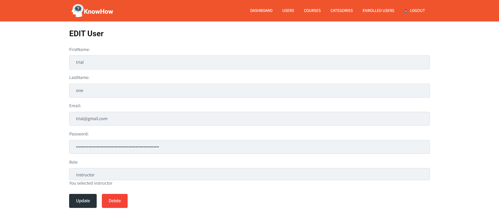

## About the Project


The **E-Learning Platform** is a full-stack web application designed to deliver a complete online learning experience. It supports three distinct user roles — **Students, Instructors, and Admins** — each with tailored features and dashboards.

Unlike many basic MERN demos, this project goes beyond CRUD operations. It implements a **role-based learning ecosystem** with secure authentication, structured data models, and media handling for lectures. It was built to demonstrate how real-world learning management systems (LMS) can be architected and deployed.

### Why this project?
-  **Education + Technology Impact**: The demand for remote learning platforms surged after COVID-19. This project shows how a scalable LMS can be implemented using open-source technologies.  
- **Security-first approach**: Authentication is powered by **JWT tokens** and **Passport-JWT**, ensuring that only authorized users access the right features.  
- **End-to-End Engineering**: Covers the entire development lifecycle — database schema design, API development, role-based authorization, React/Redux frontend, and deployment readiness.  
- **Interview Value**: Demonstrates both **system design thinking** (roles, flows, relations) and **hands-on coding skills** (MERN stack, file uploads, REST API, Redux state management).

### Key Highlights
- **Role Separation**: Students consume content, Instructors create content, and Admins govern the system.  
- **Flexible Lectures**: Support for both YouTube links and local video uploads.  
- **Data Integrity**: Structured models for Users, Courses, Categories, Lectures, Enrollments, and Profiles.  
- **Scalable Stack**: Built with the MERN stack, making it deployable on cloud platforms like AWS, Render, or Heroku.  
- **Dashboard-driven UX**: Each role gets personalized views to focus on their tasks.

### Potential Use Cases
- University or college online course portals.  
- Corporate training and certification platforms.  
- Freelance instructors hosting paid or free content.  
- A demonstration project to showcase **full-stack development + system design skills** in interviews.


## Project Flow

The platform is structured around **three roles** — Student, Instructor, and Admin.  
Each role has its own flow, features, and permissions.

---

### Student Flow
1. **Sign Up & Login** → Student registers and receives JWT token for secure access.  
2. **Browse Courses & Categories** → Explore all available courses under categories.  
3. **Enroll in Courses** → Select a course and enroll; enrollment record is created.  
4. **Access Lectures** → Once enrolled, student can watch course lectures (via YouTube link or uploaded video).  
5. **Profile Management** → Student can update personal info, education, and view progress.

---


---


---


---

### Instructor Flow
1. **Login as Instructor** → Redirected to Instructor dashboard.  
2. **Create New Course** → Enter course details, assign category.  
3. **Add Lectures** → Upload lecture video (local upload) or provide YouTube link.  
4. **Manage Enrollments** → View students enrolled in their courses.  
5. **Update Courses** → Edit course details or add/remove content as needed.  

---


---


---


---


---

### Admin Flow
1. **Login as Admin** → Redirected to Admin dashboard with system-wide access.  
2. **Manage Categories** → Create, update, and delete categories.  
3. **Manage Users** → View and manage student/instructor accounts.  
4. **Manage Courses** → Approve, update, or remove courses.  
5. **System Oversight** → Ensure smooth operations across platform.  

---


---


---


---


---




---

### Flow Summary
- **Students** consume content.  
- **Instructors** create/manage content.  
- **Admins** govern and oversee the entire platform.  

This **clear separation of roles** ensures security, scalability, and real-world usability.

### Project Flow — At a Glance


### Role–Action Matrix

| Action / Feature                  | Student | Instructor | Admin |
|----------------------------------|:-------:|:----------:|:-----:|
| Register / Login (JWT)           |   ✅    |     ✅     |  ✅   |
| Browse Categories & Courses      |   ✅    |     ✅     |  ✅   |
| Enroll in Courses                |   ✅    |     —      |  ✅*  |
| Create / Update Courses          |   —     |     ✅     |  ✅   |
| Add Lectures (YouTube / Local)   |   —     |     ✅     |  ✅   |
| Manage Enrollments               |   —     |     ✅     |  ✅   |
| Manage Categories                |   —     |     —      |  ✅   |
| Manage Users                     |   —     |     —      |  ✅   |
| Profiles                         |   ✅    |     ✅     |  ✅   |


## Technical Deep Dive

This section explains **all technical details** of the project — architecture, data models, authentication flow, APIs, scalability, and security.  
It is designed so that any interview question about this project can be answered directly from here.

---

### Tech Stack Overview
- **Frontend:** React, Redux, React Router (role-based UI, state management)  
- **Backend:** Node.js, Express.js (REST APIs, modular routing)  
- **Database:** MongoDB with Mongoose ODM  
- **Authentication:** JWT (Bearer tokens) with Passport-JWT  
- **File Handling:** express-fileupload (local uploads) + YouTube link integration  
- **Security:** Bcrypt (password hashing), JWT expiry (3600s), middleware role checks  
- **Tooling:** Nodemon, Concurrently, Postman for API testing  

---

### Directory Structure

```plaintext
E-Learning_Platform/
├─ client/                  # React frontend (Redux, Router, UI components)
│   ├─ public/              # Static assets
│   ├─ src/                 # React source code
│   │   ├─ components/      # Reusable React components
│   │   ├─ actions/         # Redux actions
│   │   ├─ reducers/        # Redux reducers
│   │   ├─ store.js         # Redux store config
│   │   ├─ App.js           # Root React component
│   │   └─ index.js         # Entry point for React
│   └─ package.json         # Frontend dependencies & scripts
│
├─ config/                  # Backend configuration
│   ├─ keys.js              # MongoDB URI & JWT secret (replace with .env in prod)
│   └─ passport.js          # Passport-JWT strategy
│
├─ models/                  # Mongoose schemas
│   ├─ User.js              # User model (Student/Instructor/Admin)
│   ├─ Course.js            # Course model
│   ├─ Category.js          # Category model
│   ├─ Lecture.js           # Lecture model
│   ├─ Enrollment.js        # Enrollment model
│   └─ Profile.js           # Profile model
│
├─ routes/                  
│   └─ api/                 # Express routes for APIs
│       ├─ users.js         # User auth & CRUD
│       ├─ course.js        # Course APIs
│       ├─ category.js      # Category APIs
│       ├─ lecture.js       # Lecture APIs
│       ├─ enrollRoute.js   # Enrollment APIs
│       └─ profile.js       # Profile APIs
│
├─ validation/              # Request validators
│   └─ ...                  # Validation logic for inputs
│
├─ img/                     # Screenshots and demo images
│
├─ server.js                # Express server entry point
├─ package.json             # Backend dependencies & scripts
└─ README.md                # Documentation
```


---

### Data Models

#### Entity–Relationship (ER) Diagram


### Schema Summary

| Model       | Key Fields                                                        | Notes                              |
|-------------|-------------------------------------------------------------------|------------------------------------|
| **User**    | first_name, last_name, email*, password*, role*                   | Role = student / instructor / admin |
| **Course**  | courseName*, courseDescription*, instructor (ref User), category  | Linked to Instructor & Category     |
| **Lecture** | title*, videoLink*, course (ref Course)                           | Supports YouTube / local            |
| **Category**| no*, categoryName*                                                | Groups courses                      |
| **Enrollment** | student (ref User), course (ref Course), approved              | Student ↔ Course mapping            |
| **Profile** | bio, education, experience, socials, user (ref User)              | 1–1 with User                       |


### Authentication & Security Flow


#### API Modules & Routes

| Module         | Key Endpoints                                                                 |
|----------------|-------------------------------------------------------------------------------|
| **Auth / Users** | `POST /users/register`, `POST /users/login`, `GET /users`, `PUT /user`, `DELETE /user` |
| **Courses**      | `POST /course/add`, `GET /courses`, `PUT /course?id=`, `DELETE /course?id=` |
| **Lectures**     | `GET /lectures?id=<courseId>`, `POST /lectures/youtubeupload`, `POST /lectures/localupload` |
| **Enrollments**  | `POST /enroll/add`, `GET /enrollments`, `DELETE /enrollment?id=`            |
| **Categories**   | `POST /category/add`, `GET /categories`, `PUT /category?id=`                |
| **Profiles**     | `POST /profile`, `GET /profile/:id`, `PUT /profile`                         |


### Request Lifecycle (Step by Step)

1. **User logs in** → token generated via `POST /users/login`.
2. **Client stores token** → every protected request sends `Authorization: Bearer <token>`.
3. **Middleware verification** → `passport.js` (Passport-JWT) verifies token signature & expiry.
4. **Role check** → only **Instructor/Admin** can access privileged endpoints (via `req.user.role`).
5. **DB operation** → Mongoose executes the query (CRUD on models).
6. **Response** → JSON returned to the client (success or error payload).


### Security Considerations

- **Secrets management**  
  - `mongoURI`, `secretOrKey` are currently in `config/keys.js`; **move to `.env`** (use `dotenv`).
- **Input validation**  
  - Add schema validation (e.g., **express-validator** or **Joi**) on all request bodies/params.
- **File uploads**  
  - Enforce **size/type limits** and safe paths when using local uploads (or prefer a managed store).
- **Rate limiting & brute-force protection**  
  - Apply **express-rate-limit** on auth routes (`/users/login`, `/users/register`).
- **Transport security**  
  - Enforce **HTTPS** in production (e.g., behind NGINX/Cloud provider) and set **Secure**/**HttpOnly** flags where applicable.
- **CORS & headers**  
  - Configure CORS allowlist and add security headers (e.g., **helmet**).
- **Error handling**  
  - Centralize error responses; avoid leaking stack traces or internal messages in production.


### Scalability Considerations

- **Stateless auth**  
  - **JWT** enables horizontal scaling (no server session affinity).
- **Database scale & HA**  
  - Use MongoDB **replica sets** (HA) and **sharding** for very large datasets.
- **File storage & delivery**  
  - Replace local storage with **S3/Cloudinary** + **CDN** (faster, cheaper egress, versioning).
- **Service decomposition**  
  - Future split into **auth-service**, **course-service**, **enrollment-service** (clear ownership, independent scaling).
- **Caching**  
  - Add **Redis** for hot reads (course catalog, categories, user profile), plus cache-invalidation strategy.
- **Edge & proxy**  
  - Put **NGINX**/**Cloud Load Balancer** in front for routing, TLS termination, and rate limiting at the edge.
- **Observability**  
  - Centralized logs (Winston), metrics (Prometheus), dashboards (Grafana), tracing (OpenTelemetry) for bottleneck analysis.


## Quick Start

### Prerequisites
- Node.js LTS (>=16.x recommended)
- npm
- MongoDB (local or Atlas cluster)

---

### 1. Clone
```bash
git clone https://github.com/devarshpatel1506/E-Learning_Platform.git
cd E-Learning_Platform
```
### 2. Install dependencies
```bash
# Server deps
npm install

# Client deps
cd client
npm install
cd ..
```
### 3. Configure environment
```bash
# Copy the example config and set your own values:
cp config/keys.js.example config/keys.js

#config/keys.js.example
module.exports = {
  mongoURI: "mongodb+srv://<user>:<pass>@<cluster>/<db>?retryWrites=true&w=majority",
  secretOrKey: "your_jwt_secret"
};
```
### 4. Run (development)
```bash
# Run backend only
npm run server
# Starts Express server on http://localhost:5000

# Run frontend only
npm run client
Starts React dev server on http://localhost:3000

# Run both together
npm run dev
